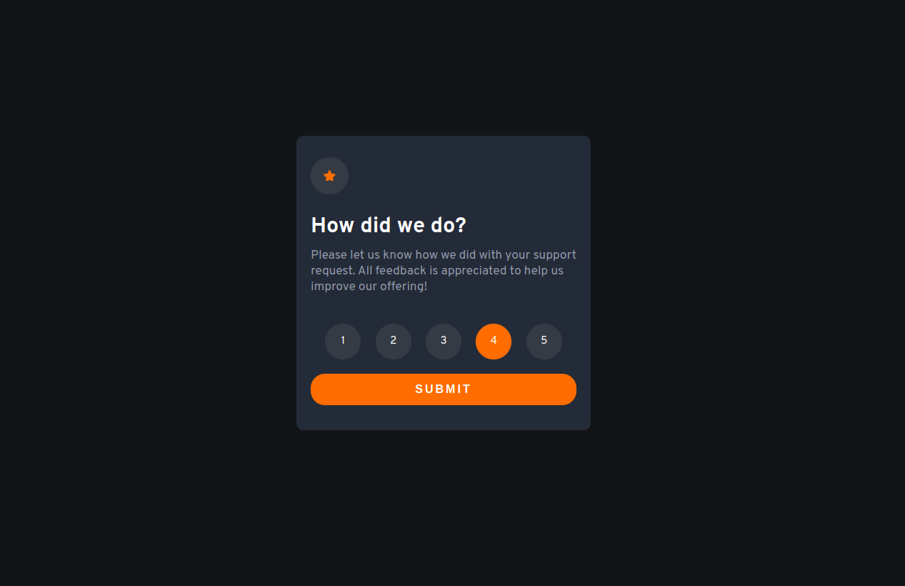
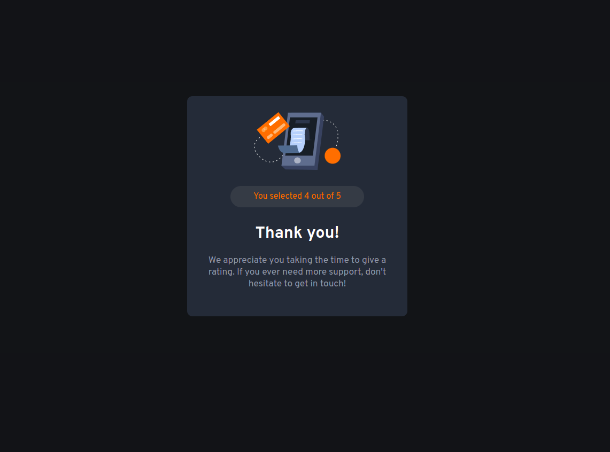

# Frontend Mentor - Interactive rating component solution

This is a solution to the [Interactive rating component challenge on Frontend Mentor](https://www.frontendmentor.io/challenges/interactive-rating-component-koxpeBUmI). Frontend Mentor challenges help you improve your coding skills by building realistic projects. 

### The challenge

Users should be able to:

- View the optimal layout for the app depending on their device's screen size
- See hover states for all interactive elements on the page
- Select and submit a number rating
- See the "Thank you" card state after submitting a rating

### Screenshot

### Links

- GitHub repository: [Repository](https://github.com/dudleydelgado/Interactive-rating-component-challenge)
- Solution URL: [Frontendmentor solution](https://www.frontendmentor.io/solutions/interactive-rating-component-_x3JSxr7Xw)
- Live Site URL: [Live site](https://dudleydelgado.github.io/Interactive-rating-component-challenge/)

### Built with

- Semantic HTML5 markup
- CSS custom properties
- Flexbox
- Mobile-first workflow
- JavaScript

## Author

- Dudley Delgad, Frontend Developer
- Frontend Mentor - [@dudleydelgado](https://www.frontendmentor.io/profile/dudleydelgado)
- Instagram - [@dudley.code](https://www.instagram.com/dudley.code/)
